# Sistema de Cadastro de Alunos e Treinos

Este projeto implementa um sistema CRUD (Create, Read, Update, Delete) para gerenciar cadastros de alunos e treinos em uma academia

## Funcionalidades

- **Gerenciamento de Alunos**: Adicionar, visualizar, atualizar e remover Alunos.
- **Gerenciamento de Treinos**: Adicionar, visualizar, atualizar e remover Treinos.

## Algumas interfaces:
**Tela Inicial**:
  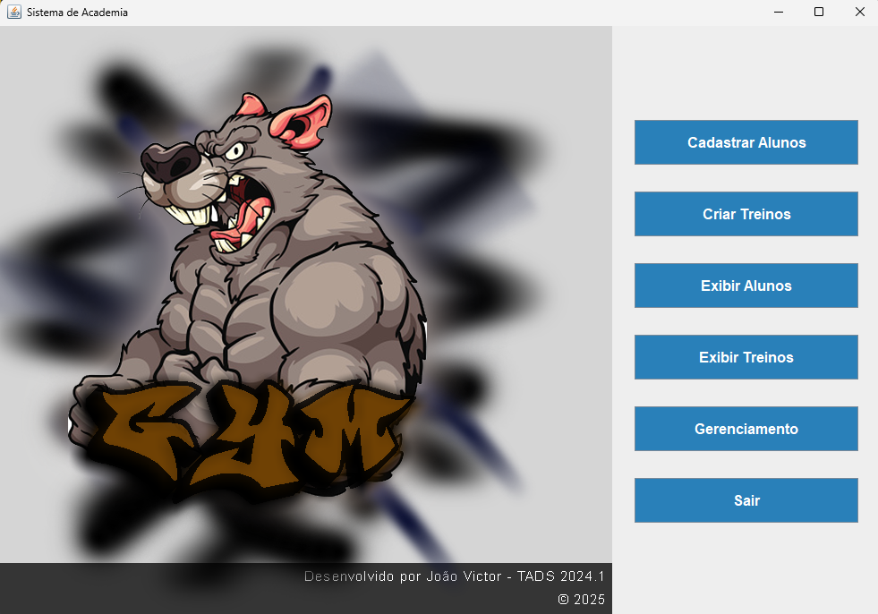 
  
**Cadastro de Alunos**:
  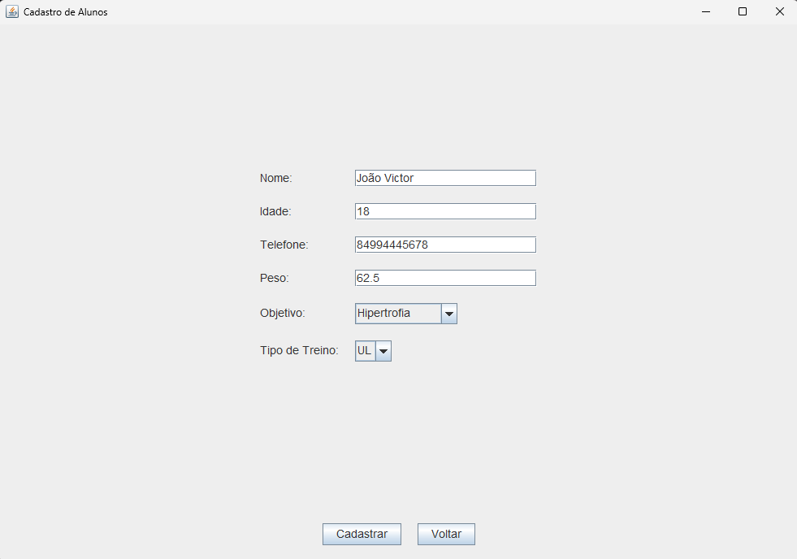
  
**Criação de Treinos**:
  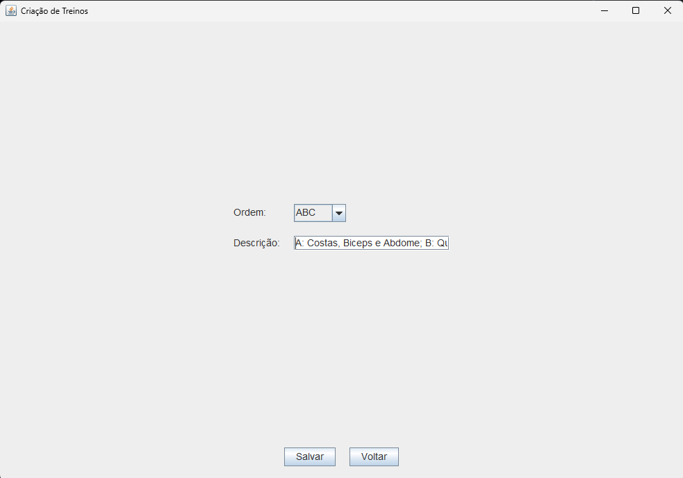

**Tabela de Alunos Cadastrados**:
  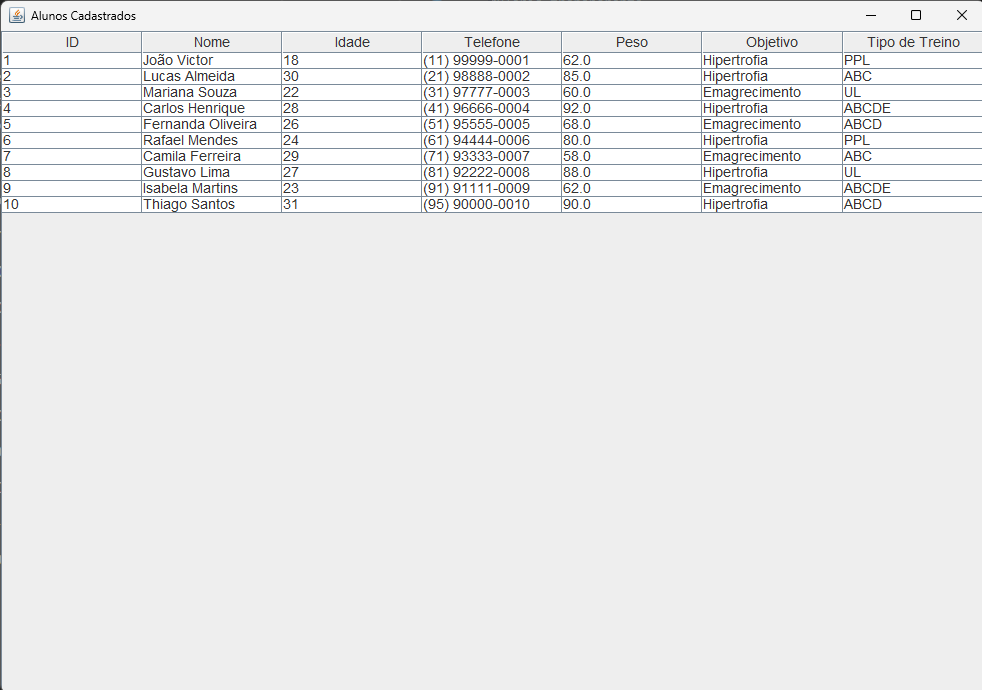

**Tabela de Treinos Criados**:
  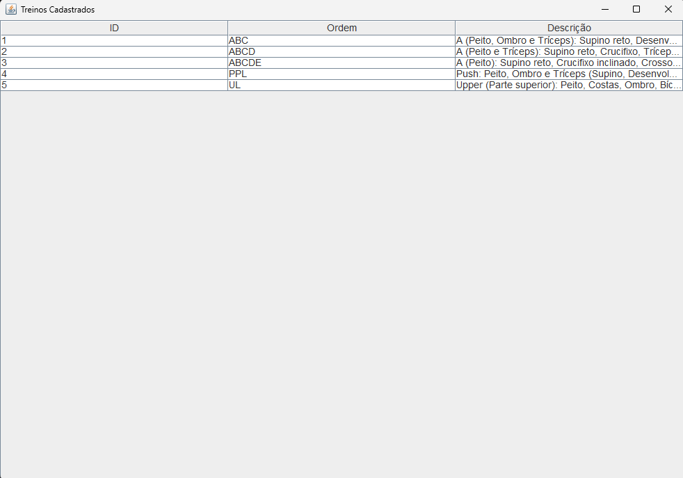

**Opções de Gerenciamento**:
  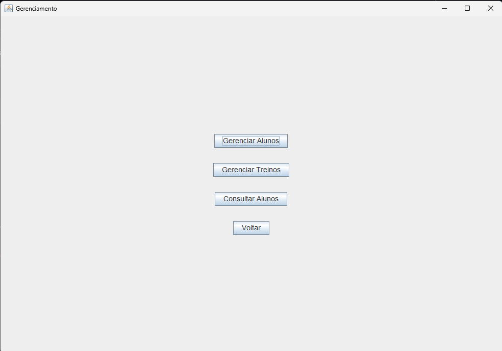

**Gerenciamento de Alunos**:
  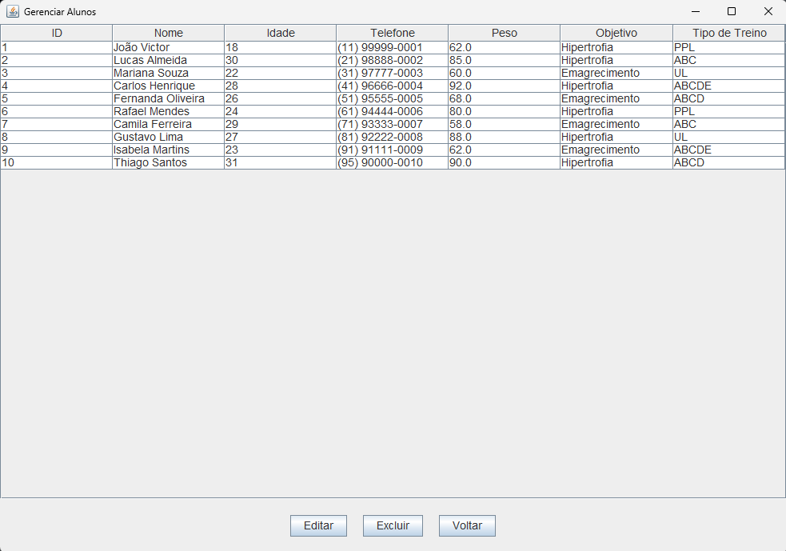

**Gerenciamento de Treinos**:
  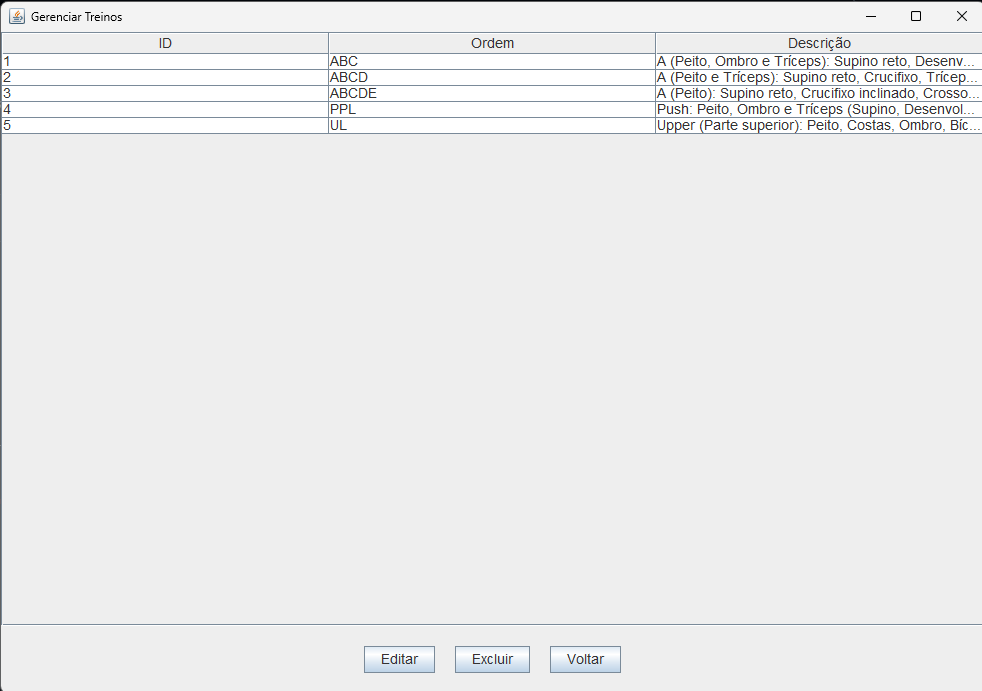

**Tela de Busca de Alunos**:
  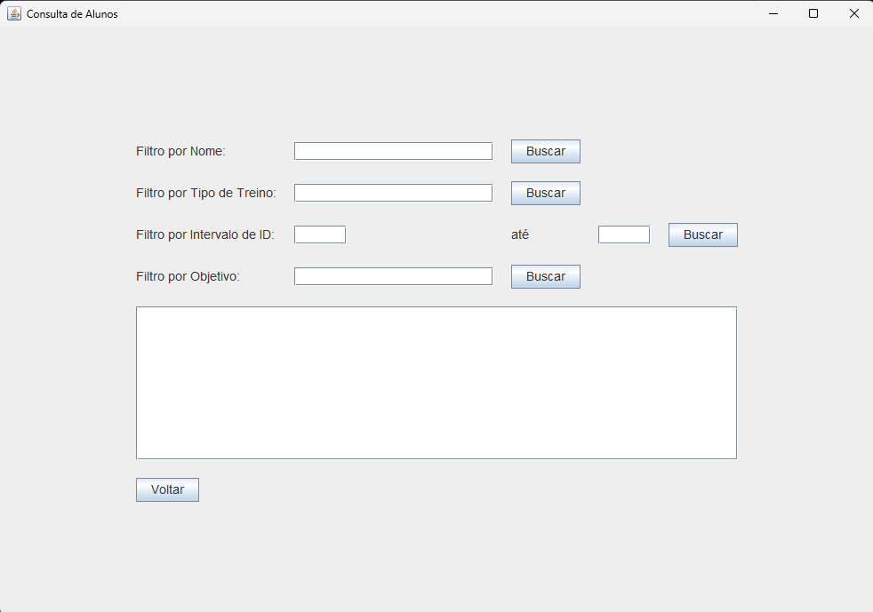
  

## Diagrama ER
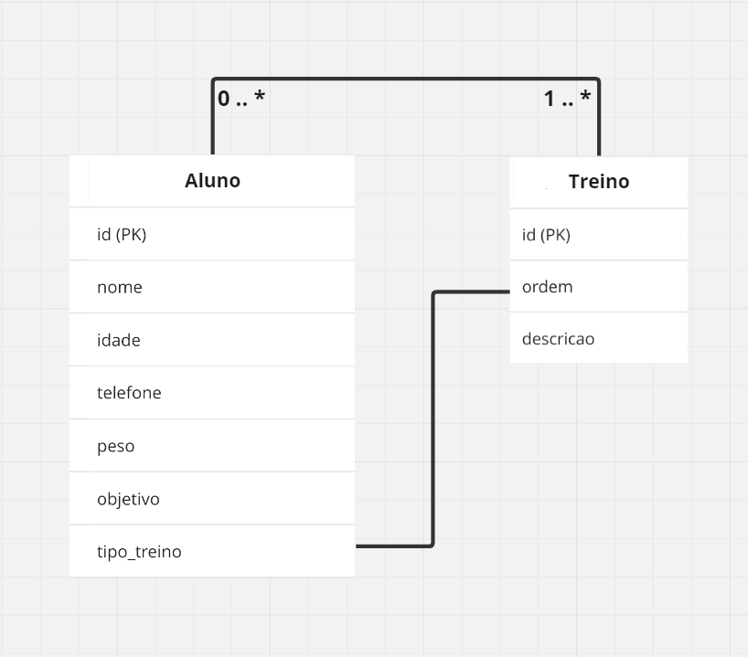

## Dicionário de Dados

### Tabela: `alunos`
| Campo | Tipo | Tamanho | Descrição |
|-------------------|--------------|---------|------------|
| id                | INT          |         | Identificador único do aluno (Primary Key). |
| nome              | VARCHAR      | 255     | Nome completo do aluno. |
| idade             | INT          |         | Idade do aluno. |
| telefone          | VARCHAR      | 255     | Telefone para contado do aluno. |
| peso              | DOUBLE       |         | Peso atual do aluno em quilogramas. |
| objetivo          | VARCHAR      | 255     | Objetivo do aluno (Hipertrofia, Emagrecimento). |
| tipo_treino       | VARCHAR      | 255     | Tipo de trino escolhido pelo aluno. |

### Tabela: `treinos`
| Campo | Tipo | Tamanho | Descrição |
|-------------------|--------------|---------|------------|
| id                | INT          |         | Identificador único do treino (Primary Key) |
| oredom            | VARCHAR      | 255     | Ordem do treino (ABC, ABCD, ABCDE, PPL, UL) |
| descricao         | VARCHAR      | 255     | Descrição detalhada do treino |

## Diagrama de classes
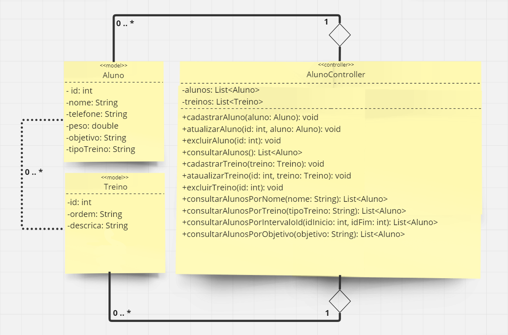
